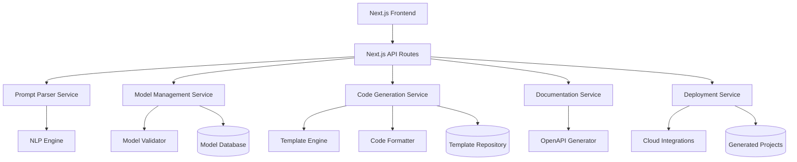

# Design Document

## Overview

The API Generator is a web-based tool that transforms natural language descriptions into production-ready APIs. The system consists of a Next.js application that handles both frontend user interaction and backend API routes, with specialized services for processing and generation. The system produces complete API projects with authentication, CRUD operations, and OpenAPI documentation.

The architecture leverages Next.js's full-stack capabilities with API routes for backend services, while maintaining clear separation between the parsing engine, model management, code generation, and deployment services. The system uses modern web technologies and follows industry best practices for scalability and maintainability.

## Architecture



### Core Components

1. **Next.js Application**: Full-stack application with React frontend and API routes
2. **API Routes**: Next.js API routes handling backend logic and middleware
3. **Prompt Parser Service**: NLP-powered service for extracting models from text
4. **Model Management Service**: Handles model CRUD operations and validation
5. **Code Generation Service**: Template-based code generation engine
6. **Documentation Service**: OpenAPI specification generator
7. **Deployment Service**: Integration with cloud platforms for deployment

## Components and Interfaces

### Frontend Components

#### PromptInput Component

- **Purpose**: Captures user's natural language description
- **Props**: `onSubmit: (prompt: string) => void`, `loading: boolean`
- **State**: Input text, validation errors
- **Features**: Real-time validation, example prompts, character limit

#### ModelEditor Component

- **Purpose**: Visual editor for data models and relationships
- **Props**: `models: Model[]`, `onModelChange: (models: Model[]) => void`
- **State**: Selected model, editing mode, relationship connections
- **Features**: Drag-and-drop interface, relationship visualization, field type selection

#### APIPreview Component

- **Purpose**: Shows generated API structure and sample requests
- **Props**: `apiSpec: OpenAPISpec`, `models: Model[]`
- **State**: Selected endpoint, sample data
- **Features**: Interactive endpoint explorer, request/response examples

#### ProjectExport Component

- **Purpose**: Handles project download and deployment options
- **Props**: `projectId: string`, `deploymentOptions: DeploymentOption[]`
- **State**: Export format, deployment target
- **Features**: Multiple export formats, cloud platform integration

### Backend Services

#### PromptParserService

```typescript
interface PromptParserService {
  parsePrompt(prompt: string): Promise<ParsedModels>;
  validateModels(models: Model[]): ValidationResult;
  suggestImprovements(models: Model[]): Suggestion[];
}
```

#### ModelManagementService

```typescript
interface ModelManagementService {
  createModel(model: ModelDefinition): Promise<Model>;
  updateModel(id: string, updates: Partial<Model>): Promise<Model>;
  deleteModel(id: string): Promise<void>;
  getModels(projectId: string): Promise<Model[]>;
  validateRelationships(models: Model[]): ValidationResult;
}
```

#### CodeGenerationService

```typescript
interface CodeGenerationService {
  generateProject(
    models: Model[],
    options: GenerationOptions
  ): Promise<GeneratedProject>;
  generateCRUDOperations(model: Model): Promise<CRUDEndpoints>;
  generateAuthentication(authConfig: AuthConfig): Promise<AuthModule>;
  generateMiddleware(
    middlewareConfig: MiddlewareConfig
  ): Promise<MiddlewareModule>;
}
```

#### DocumentationService

```typescript
interface DocumentationService {
  generateOpenAPISpec(
    models: Model[],
    endpoints: Endpoint[]
  ): Promise<OpenAPISpec>;
  generateSwaggerUI(spec: OpenAPISpec): Promise<string>;
  updateDocumentation(projectId: string, changes: ModelChange[]): Promise<void>;
}
```

## Data Models

### Core Models

#### Model

```typescript
interface Model {
  id: string;
  name: string;
  fields: Field[];
  relationships: Relationship[];
  metadata: ModelMetadata;
  createdAt: Date;
  updatedAt: Date;
}
```

#### Field

```typescript
interface Field {
  id: string;
  name: string;
  type: FieldType;
  required: boolean;
  unique: boolean;
  defaultValue?: any;
  validation: ValidationRule[];
  description?: string;
}
```

#### Relationship

```typescript
interface Relationship {
  id: string;
  type: 'oneToOne' | 'oneToMany' | 'manyToMany';
  sourceModel: string;
  targetModel: string;
  sourceField: string;
  targetField: string;
  cascadeDelete: boolean;
}
```

#### GeneratedProject

```typescript
interface GeneratedProject {
  id: string;
  name: string;
  models: Model[];
  endpoints: Endpoint[];
  authConfig: AuthConfig;
  files: GeneratedFile[];
  openAPISpec: OpenAPISpec;
  deploymentConfig: DeploymentConfig;
}
```

### Configuration Models

#### GenerationOptions

```typescript
interface GenerationOptions {
  framework: 'express' | 'fastify' | 'koa';
  database: 'postgresql' | 'mysql' | 'mongodb';
  authentication: 'jwt' | 'oauth' | 'session';
  language: 'typescript' | 'javascript';
  includeTests: boolean;
  includeDocumentation: boolean;
}
```

#### AuthConfig

```typescript
interface AuthConfig {
  type: 'jwt' | 'oauth' | 'session';
  providers?: OAuthProvider[];
  jwtSecret?: string;
  sessionConfig?: SessionConfig;
  roles: Role[];
  protectedRoutes: string[];
}
```

## Error Handling

### Error Categories

1. **Validation Errors**: Invalid model definitions, relationship conflicts
2. **Generation Errors**: Template processing failures, code compilation issues
3. **Deployment Errors**: Cloud platform integration failures
4. **System Errors**: Database connectivity, service unavailability

### Error Response Format

```typescript
interface ErrorResponse {
  error: {
    code: string;
    message: string;
    details?: any;
    timestamp: Date;
    requestId: string;
  };
}
```

### Error Handling Strategy

- **Frontend**: Global error boundary with user-friendly messages
- **Backend**: Centralized error middleware with logging
- **Services**: Circuit breaker pattern for external dependencies
- **Database**: Connection pooling with retry logic
- **Generation**: Rollback mechanism for failed generations

## Testing Strategy

### Unit Testing

- **Frontend**: Jest + React Testing Library for component testing
- **Backend**: Jest + Supertest for API endpoint testing
- **Services**: Isolated unit tests with mocked dependencies
- **Utilities**: Pure function testing with comprehensive edge cases

### Integration Testing

- **API Integration**: End-to-end API workflow testing
- **Database Integration**: Repository pattern testing with test database
- **Service Integration**: Inter-service communication testing
- **Generation Integration**: Complete generation pipeline testing

### End-to-End Testing

- **User Workflows**: Cypress tests for complete user journeys
- **Generated Code**: Automated testing of generated API projects
- **Deployment**: Testing deployment to staging environments
- **Performance**: Load testing for generation and API performance

### Test Data Management

- **Fixtures**: Predefined model definitions and prompts
- **Factories**: Dynamic test data generation
- **Cleanup**: Automated test data cleanup between runs
- **Isolation**: Each test runs with isolated data

### Quality Assurance

- **Code Coverage**: Minimum 80% coverage requirement
- **Static Analysis**: ESLint, TypeScript strict mode
- **Security Testing**: OWASP dependency scanning
- **Performance Testing**: Response time and memory usage monitoring
